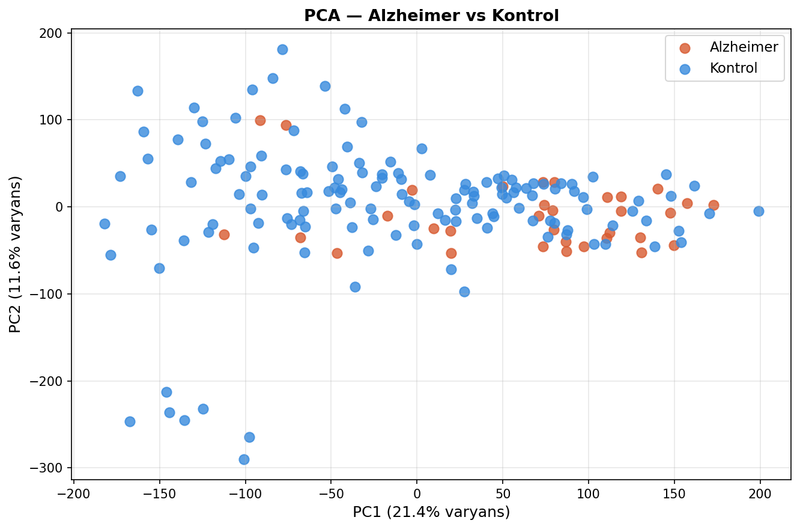
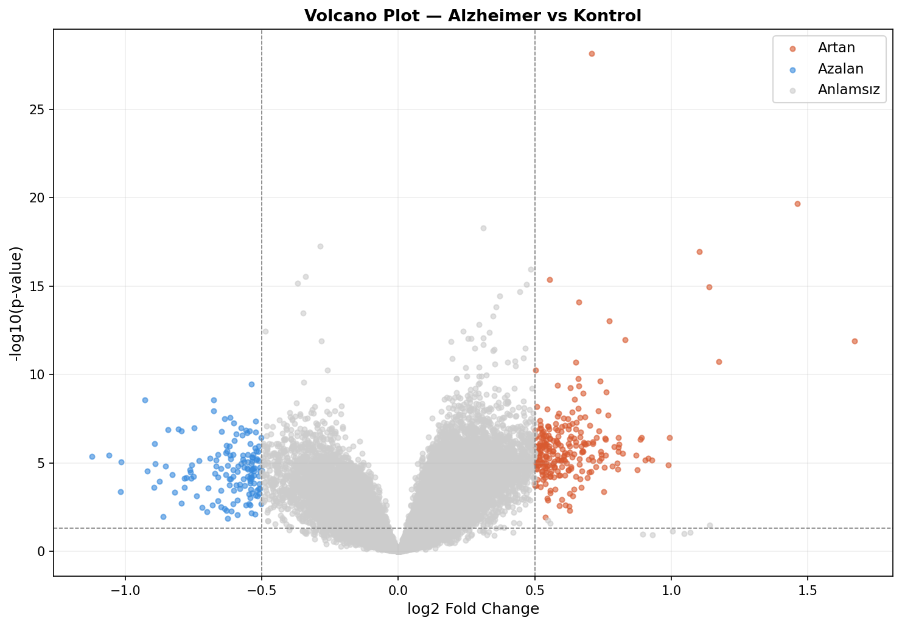
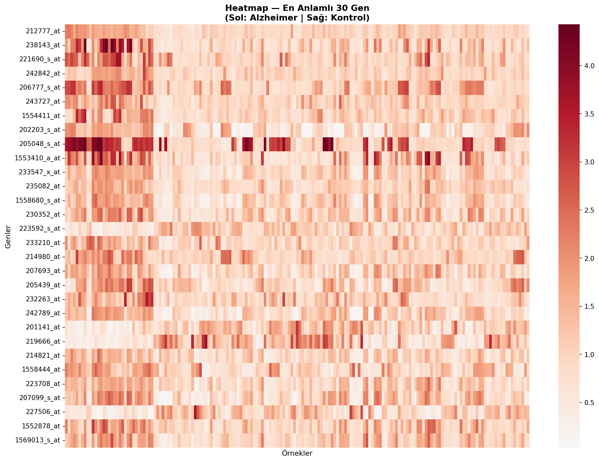
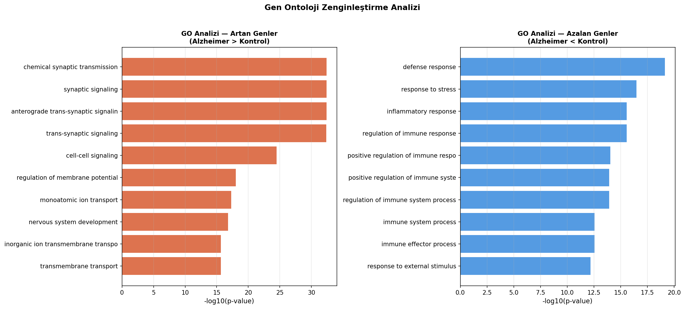
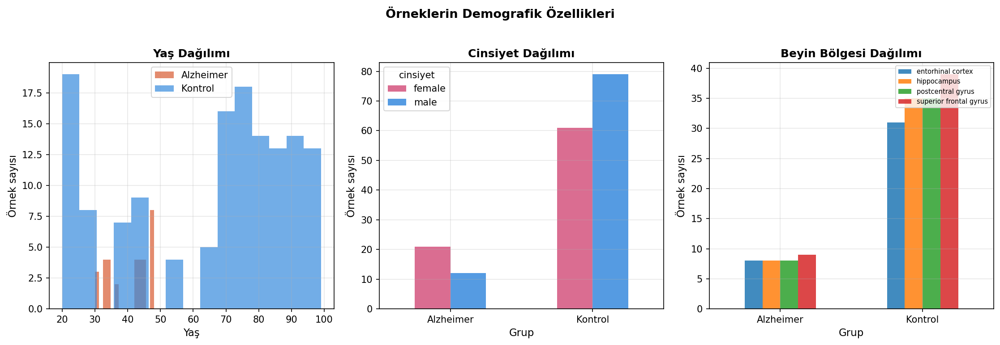
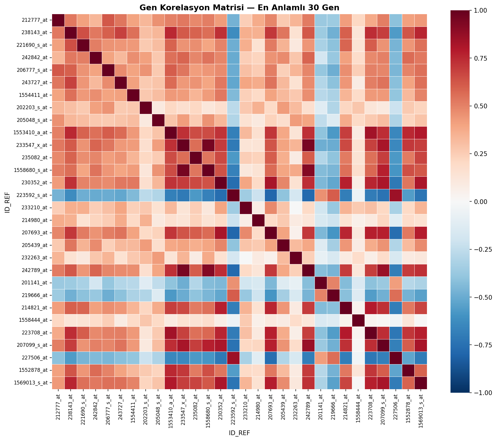

# alzheimer-rnaseq-analysis

[](https://colab.research.google.com/github/elifozlembagci/alzheimer-rnaseq-analysis/blob/main/alzheimer_rnaseq_analysis.ipynb)

> 🇬🇧 [English](#english) | 🇹🇷 [Türkçe](#türkçe)

---

## English

### Differential Gene Expression Analysis of Early-Onset Alzheimer's Disease

A complete transcriptomic analysis pipeline applied to real patient microarray data from NCBI GEO, comparing early-onset Alzheimer's disease brain tissue against healthy controls.

#### Dataset

- **GEO Accession:** GSE48350
- **Platform:** GPL570 (Affymetrix Human Genome U133 Plus 2.0)
- **Alzheimer samples:** 33 (mean age: 40.4 years — early-onset)
- **Control samples:** 140 (mean age: 64.6 years)
- **Brain regions:** Entorhinal cortex, hippocampus, postcentral gyrus, superior frontal gyrus

#### What This Project Does

- Downloads and parses real GEO microarray data using GEOparse
- Filters low-expression probes and applies log2 normalization
- Performs **PCA** to visualize sample clustering
- Runs **differential expression analysis** (t-test + Benjamini-Hochberg correction)
- Generates **Volcano plot** to identify significant genes
- Creates **heatmap** of top differentially expressed genes
- Analyzes **demographic confounders** (age, sex, brain region)
- Computes **gene correlation matrix** across top genes
- Performs **GO enrichment analysis** using g:Profiler

#### Key Results

| Analysis | Result |
|---|---|
| Total genes analyzed | 39,961 |
| Significantly upregulated | 254 genes |
| Significantly downregulated | 147 genes |
| Top upregulated pathway | Chemical synaptic transmission (p=10⁻³³) |
| Top downregulated pathway | Defense/inflammatory response (p=10⁻¹⁹) |

#### Key Genes

| Gene | Function | Direction |
|---|---|---|
| CTNNB1 | Wnt pathway, beta-catenin | ↑ Upregulated |
| NLRP2 | Neuroinflammation | ↑ Upregulated |
| PDE1A | Synaptic signaling | ↑ Upregulated |
| SOS1 | RAS pathway | ↑ Upregulated |

#### Visualizations

**PCA — Sample Clustering**


**Volcano Plot — Differential Expression**


**Heatmap — Top 30 Genes**


**GO Enrichment Analysis**


**Demographic Analysis**


**Gene Correlation Matrix**


#### Limitations

- Age mismatch: Alzheimer group is significantly younger (40 vs 65 years)
- Brain region effect not corrected for
- Microarray data (not RNA-seq); different sensitivity profile

#### Tools & Libraries

`Python` `GEOparse` `pandas` `numpy` `scipy` `scikit-learn` `matplotlib` `seaborn` `gprofiler-official`

#### How to Run

1. Open `alzheimer_rnaseq_analysis.ipynb` in Google Colab
2. Run cells sequentially from top to bottom
3. Cell 0 installs all dependencies automatically

---

## Türkçe

### Erken Başlangıçlı Alzheimer Hastalığında Diferansiyel Gen Ekspresyon Analizi

NCBI GEO veri tabanından alınan gerçek hasta mikrodizi verisini kullanarak erken başlangıçlı Alzheimer beyin dokusu ile sağlıklı kontrollerin karşılaştırmalı transkriptomik analizi.

#### Veri Seti

- **GEO Erişim Kodu:** GSE48350
- **Platform:** GPL570 (Affymetrix Human Genome U133 Plus 2.0)
- **Alzheimer örnek:** 33 (ort. yaş: 40.4 — erken başlangıçlı)
- **Kontrol örnek:** 140 (ort. yaş: 64.6)
- **Beyin bölgeleri:** Entorhinal korteks, hipokampüs, postsentral girus, superior frontal girus

#### Proje Kapsamı

- GEOparse ile gerçek GEO mikrodizi verisi indirme ve ayrıştırma
- Düşük ekspresyonlu probe filtreleme ve log2 normalizasyon
- Örnek kümelenmesini görselleştirmek için **PCA**
- **Diferansiyel ekspresyon analizi** (t-test + Benjamini-Hochberg düzeltmesi)
- Anlamlı genleri belirlemek için **Volcano plot**
- En anlamlı genlerin **heatmap** görselleştirmesi
- Yaş, cinsiyet ve beyin bölgesi **demografik confounder analizi**
- En anlamlı genler arası **korelasyon matrisi**
- g:Profiler ile **GO zenginleştirme analizi**

#### Temel Sonuçlar

| Analiz | Sonuç |
|---|---|
| Analiz edilen toplam gen | 39.961 |
| Anlamlı artan gen | 254 |
| Anlamlı azalan gen | 147 |
| En anlamlı artan yolak | Chemical synaptic transmission (p=10⁻³³) |
| En anlamlı azalan yolak | Defense/inflammatory response (p=10⁻¹⁹) |

#### Önemli Genler

| Gen | Fonksiyon | Yön |
|---|---|---|
| CTNNB1 | Wnt yolağı, beta-katenin | ↑ Artan |
| NLRP2 | Nöroinflasyon | ↑ Artan |
| PDE1A | Sinaptik sinyal iletimi | ↑ Artan |
| SOS1 | RAS yolağı | ↑ Artan |

#### Limitasyonlar

- Yaş farkı: Alzheimer grubu çok daha genç (40 vs 65 yaş)
- Beyin bölgesi etkisi istatistiksel olarak kontrol edilmedi
- Mikrodizi verisi (RNA-seq değil); farklı duyarlılık profili

#### Kullanılan Araçlar

`Python` `GEOparse` `pandas` `numpy` `scipy` `scikit-learn` `matplotlib` `seaborn` `gprofiler-official`

#### Nasıl Çalıştırılır

1. `alzheimer_rnaseq_analysis.ipynb` dosyasını Google Colab'da açın
2. Hücreleri yukarıdan aşağıya sırayla çalıştırın
3. Cell 0 tüm bağımlılıkları otomatik olarak yükler

---

### Repository Structure

```
alzheimer-rnaseq-analysis/
├── alzheimer_rnaseq_analysis.ipynb   # Ana analiz notebook'u
├── pca_plot.png                      # PCA grafiği
├── volcano_plot.png                  # Volcano plot
├── heatmap.png                       # Top 30 gen heatmap
├── go_analizi.png                    # GO zenginleştirme grafiği
├── demografik_analiz.png             # Demografik analiz
├── korelasyon_matrisi.png            # Gen korelasyon matrisi
├── anlamli_genler_annotated.csv      # Anlamlı genler tablosu
├── go_artan_yolaklar.csv             # GO yolaklar tablosu
└── README.md
```
